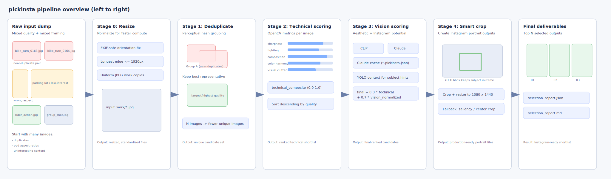
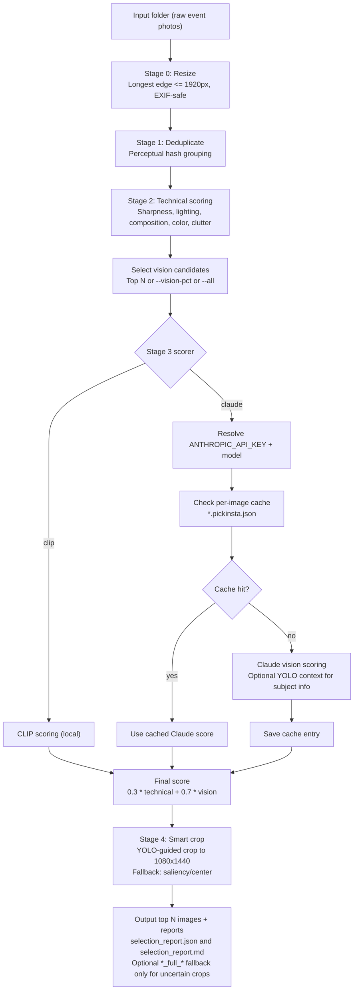

# pickinsta
[](https://www.python.org/downloads/)
[](https://github.com/renatobo/pickinsta/actions/workflows/ci.yml)
[](https://github.com/astral-sh/ruff)
[](https://www.gnu.org/licenses/old-licenses/gpl-2.0.en.html)

Instagram image selection pipeline package.

## Quick start

```bash
python3 -m venv .venv
source .venv/bin/activate
make install-dev
python -m pip install -e ".[clip,claude,yolo]"
pickinsta ./input --output ./selected --top 10 --scorer clip
```

## Documentation

Project docs are in `/Users/renatobo/development/pickinsta/docs`:
- `docs/README.md` (documentation index)
- `docs/composition-rules.md` (composition/scoring/cropping reference)
- `docs/troubleshooting.md` (setup and runtime troubleshooting)

## Pipeline workflow



Detailed flow:



## Install (recommended)

```bash
cd /path/to/pickinsta
python3 -m venv .venv
source .venv/bin/activate
python -m pip install --upgrade pip setuptools
python -m pip install -e ".[clip,claude,yolo]"
python -c "import transformers, torch, anthropic, ultralytics; print(transformers.__version__, torch.__version__, anthropic.__version__, ultralytics.__version__)"
```

If you only need one scorer:

```bash
# CLIP only
python -m pip install -e ".[clip]"

# Claude only
python -m pip install -e ".[claude]"

# YOLO support (smart crop + Claude context enrichment)
python -m pip install -e ".[yolo]"
```

If `ultralytics` is not installed, YOLO is disabled and smart crop falls back to saliency/center heuristics.

## Optional manual dependency install

```bash
pip install Pillow opencv-python numpy imagehash
pip install transformers torch
pip install anthropic tqdm
pip install ultralytics
```

## .env setup (Claude + optional HF token)

Create a `.env` file with your key:

```bash
cp .env.example .env
# then edit .env and set your real key
```

Required content:

```bash
ANTHROPIC_API_KEY=your_key_here
```

Optional content:

```bash
HF_TOKEN=hf_xxx_your_token
# optional Claude model override:
ANTHROPIC_MODEL=claude-sonnet-4-6
# optional account context used in Claude prompt:
PICKINSTA_ACCOUNT_CONTEXT="motorcycle enthusiast account"
```

When `--scorer claude` is used, `pickinsta` checks:
1. `ANTHROPIC_API_KEY` from the current environment
2. `.env` in the current working directory
3. `.env` in the input photos folder

When `--scorer clip` is used, `HF_TOKEN` is optional. If present, `pickinsta`
loads it from environment or `.env` (same search order) to reduce HF warnings
and improve download/rate limits. If missing, CLIP still runs.

YOLO model weights are downloaded at runtime on first YOLO use to:
- `~/.cache/pickinsta/models/yolov8n.pt`

Override model path with:
- `PICKINSTA_YOLO_MODEL=/absolute/path/to/model.pt`

## Run

From the project folder (with venv active):

```bash
mkdir -p ./input ./selected
pickinsta ./input --output ./selected --top 10 --scorer clip
```

Or as a module:

```bash
python -m pickinsta ./input --output ./selected --top 10 --scorer claude
```

Show full CLI options:

```bash
pickinsta -h
```

To score all Stage 2 images (CLIP or Claude), use `--all` instead of the `--vision-pct` cutoff:

```bash
pickinsta ./input --output ./selected --scorer claude --all
# or
pickinsta ./input --output ./selected --scorer clip --all
```

For Claude, you can score on pre-cropped 4:5 candidates to better align
ranking with final portrait output quality:

```bash
pickinsta ./input --output ./selected --scorer claude --all --claude-crop-first
```

Reports are written to `./selected`:
- `selection_report.json` (top selected outputs)
- `selection_report.md` (top outputs + full vision/Claude scores for all analyzed images)

Output files:
- `NN_<image-stem>.jpg` (always, ranked crop output)
- `NN_full_<image-stem>.jpg` (optional, only when crop uncertainty is detected: subject too large/clipped/too close to borders)

Claude caching:
- Claude responses are cached per original input image file.
- Cache file format: `<original_filename>.pickinsta.json` in the same input folder.
  Example: `IMG_1234.jpg.pickinsta.json`
- Cache validity includes image content hash + Claude model + prompt hash.

## Running tests

Run the full automated test suite:

```bash
make test
```

Run a specific test file:

```bash
.venv/bin/pytest -q tests/test_scoring_and_reports.py
```

Lint code:

```bash
make lint
```

Run both lint + tests:

```bash
make check
```

See detailed test coverage notes in `tests/README.md`.

## Contributing

See `CONTRIBUTING.md` for development workflow, PR expectations, and project layout.
