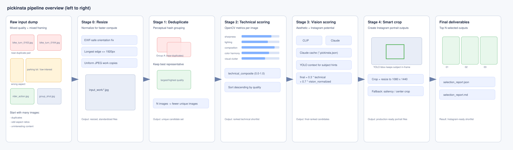

# pickinsta
[](https://www.python.org/downloads/)
[](https://github.com/renatobo/pickinsta/actions/workflows/ci.yml)
[](https://github.com/astral-sh/ruff)
[](https://www.gnu.org/licenses/old-licenses/gpl-2.0.en.html)

`pickinsta` turns a folder of event photos into ranked, Instagram-ready portrait selections. It deduplicates burst shots, scores technical quality, adds a vision pass with CLIP, Claude, or Ollama, then generates smart crops, reports, and an HTML gallery.

## What It Does

- Resizes source images into a work area so later stages are faster and consistent.
- Collapses near-duplicate burst sequences to the best representative image.
- Scores technical quality with OpenCV-based metrics such as sharpness, lighting, composition, and clutter.
- Applies a vision scorer:
  - `clip`: local, free, zero API cost
  - `claude`: API-based, strongest quality/ranking
  - `ollama`: self-hosted vision scoring
- Creates three ranked output variants per selected image:
  - `NN_cropped_<name>.jpg`
  - `NN_hd_<name>.jpg`
  - `NN_full_<name>.<ext>`
- Writes `selection_report.json`, `selection_report.md`, and `index.html`.
- Publishes immutable output generations and advances `current_run.json` as the final
  completion marker.

## Quick Start

```bash
python3 -m venv .venv
source .venv/bin/activate
make install-dev

mkdir -p ./input ./selected
pickinsta ./input --output ./selected --top 10 --scorer clip
```

For the default full local setup, `make install-dev` installs dev tooling and all scorer extras.

## Installation

`pickinsta` supports Python 3.11 through 3.14.

### Recommended

```bash
python3 -m venv .venv
source .venv/bin/activate
python -m pip install --upgrade pip setuptools
make install-dev
```

### Minimal package install

```bash
python -m pip install -e .
```

This gives the core package plus technical scoring and image processing dependencies.

### Install only the scorer extras you need

```bash
# CLIP scorer
python -m pip install -e ".[clip]"

# Claude scorer
python -m pip install -e ".[claude]"

# YOLO support for smart crop and richer scorer context
python -m pip install -e ".[yolo]"

# Full runtime without dev tools
python -m pip install -e ".[clip,claude,yolo]"
```

Optional dependency groups from [`pyproject.toml`](pyproject.toml):

- `dev`: `pytest`, `ruff`, `pre-commit`
- `clip`: `transformers`, `torch`
- `claude`: `anthropic`, `tqdm`
- `yolo`: `ultralytics`

If `ultralytics` is missing, smart crop falls back to non-YOLO heuristics.

### Dependency reproducibility

`pyproject.toml` declares minimum compatible dependency versions; the project does not currently
commit a lockfile, so CI resolves the current compatible releases. Use an isolated virtual
environment, and record the installed versions (for example, with `python -m pip freeze`) when a
benchmark run must be reproducible.

## Configuration

Copy the example env file:

```bash
cp .env.example .env
```

Common variables:

```bash
# Required for --scorer claude
ANTHROPIC_API_KEY=your_key_here

# Optional Claude model override
ANTHROPIC_MODEL=claude-sonnet-4-6

# Optional CLIP / Hugging Face token
HF_TOKEN=hf_xxx_your_token

# Optional prompt/account context
PICKINSTA_ACCOUNT_CONTEXT="motorcycle enthusiast account"

# Optional Ollama endpoint and model
PICKINSTA_OLLAMA_BASE_URL=http://127.0.0.1:11434
PICKINSTA_OLLAMA_MODEL=qwen2.5vl:7b
PICKINSTA_OLLAMA_TIMEOUT_SEC=300
PICKINSTA_OLLAMA_MAX_IMAGE_EDGE=1024
PICKINSTA_OLLAMA_JPEG_QUALITY=80
PICKINSTA_OLLAMA_KEEP_ALIVE=10m
PICKINSTA_OLLAMA_USE_YOLO_CONTEXT=false
PICKINSTA_OLLAMA_CONCURRENCY=2
PICKINSTA_OLLAMA_MAX_RETRIES=2
PICKINSTA_OLLAMA_RETRY_BACKOFF_SEC=0.75
PICKINSTA_OLLAMA_CIRCUIT_BREAKER_ERRORS=6

# Optional custom YOLO weights
PICKINSTA_YOLO_MODEL=/absolute/path/to/model.pt

# Optional local image-processing limits (1-256)
PICKINSTA_MAX_WORKERS=8
PICKINSTA_PROCESS_WORKERS=4
PICKINSTA_THREAD_WORKERS=8
# 0 preserves OpenCV's default; 1 avoids nested native-thread oversubscription
PICKINSTA_OPENCV_THREADS=1
```

Environment resolution behavior:

- Claude API key and model settings are resolved from environment, then `cwd/.env`, then `<input>/.env`.
- `HF_TOKEN` follows the same search order.
- Ollama settings follow the same search order and default to `http://127.0.0.1:11434` with model `qwen2.5vl:7b`.
- `CLAUDE_MODEL` is accepted as a fallback alias for `ANTHROPIC_MODEL`.
- Local worker limits are read at pipeline startup. Stage-specific process and
  thread limits override `PICKINSTA_MAX_WORKERS`; they do not change Claude or
  Ollama request concurrency.

## Usage

### Common commands

```bash
# Local/free scoring
pickinsta ./input --output ./selected --top 10 --scorer clip

# Claude scoring for all technically qualified images
pickinsta ./input --output ./selected --scorer claude --all

# Claude scoring on pre-cropped 4:5 candidates
pickinsta ./input --output ./selected --scorer claude --all --claude-crop-first

# Ollama scoring against a local or remote server
pickinsta ./input --output ./selected --scorer ollama --all

# Use a separate work folder
pickinsta ./input --output ./selected --work ./work --scorer clip

# Re-run vision scoring without using cached scorer results
pickinsta ./input --output ./selected --scorer claude --rescore

# Deduplicate only; no ranking or vision scoring
pickinsta ./input --output ./deduped --dedup-only

# Process each leaf subfolder under an input root and mirror the tree in output
pickinsta ./input --output ./selected --scorer claude --all --recursive
```

### Help

```bash
pickinsta -h
```

## CLI Surface

Current flags implemented in [`src/pickinsta/cli.py`](src/pickinsta/cli.py):

- `input`: source folder of event photos
- `--output`, `-o`: output folder, default `selected`
- `--work`, `-w`: intermediate work folder, default `<input>_work`
- `--top`, `-n`: number of ranked outputs, default `10`
- `--scorer`, `-s`: `clip`, `claude`, or `ollama`
- `--vision-pct`: fraction of technically scored images passed to vision scoring, default `0.5`
- `--all`: score all Stage 2 candidates
- `--claude-model`: override Claude model
- `--claude-crop-first`: pre-crop to 1080x1440 before Claude scoring
- `--rescore`: ignore cached vision results
- `--dedup-only`: emit unique-image outputs after dedup without ranking
- `--recursive`: process each leaf subfolder under the input folder and build a recursive summary

## Pipeline Overview



High-level stages:

1. Stage 0: resize inputs into a work folder with EXIF-safe handling.
2. Stage 1: deduplicate bursts with perceptual hash, histogram checks, temporal grouping, and feature verification.
3. Stage 2: compute technical quality metrics.
4. Stage 3: run the selected vision scorer on the top technical candidates or all candidates.
5. Stage 4: generate 1080x1440 smart crops, plus HD and full variants.
6. Finalize ranked reports and an HTML gallery.

Score blend:

```text
final_score = 0.3 * technical_composite + 0.7 * vision_normalized
```

## Outputs

For each selected image, `pickinsta` writes:

- `NN_cropped_<stem>.jpg`: ranked 1080x1440 portrait output
- `NN_hd_<stem>.jpg`: resized work-copy version
- `NN_full_<stem>.<ext>`: original source file copy

Per-run artifacts:

- `selection_report.json`: machine-readable summary of selected outputs
- `selection_report.md`: human-readable report including analyzed image scores
- `index.html`: browsable local gallery
- `run_manifest.json`: compatibility copy of the machine-readable run status, counts,
  issues, configuration, stage timings, cache reuse, runtime metadata, and managed
  artifact list
- `current_run.json`: atomically updated pointer to the authoritative immutable run
  generation under `.pickinsta-runs/`

Output files are built in a temporary staging directory inside the selected output
folder. `pickinsta` copies a complete immutable generation under `.pickinsta-runs/`,
updates the flat compatibility files, and atomically advances `current_run.json` last.
If the process stops during publication, the pointer still identifies the preceding
complete generation. Read the referenced generation when a consistent snapshot is
required. Unrelated files already in the output folder, such as operator notes, are
never cleaned or replaced.

A manifest status of `complete` means no output issue was recorded. `degraded` means
publication completed, but one or more selected variants could not be produced or
copied. Inspect `issues`, `processed`, `skipped`, and `failed` in the manifest, or the
run summary in `selection_report.md`, before treating a degraded run as fully usable.

The manifest's `stage_timings_seconds` values are cumulative wall-clock time for each
named stage, while `stage_invocations` shows how many measured blocks contributed to
that total. `caches.technical` and `caches.vision` report hits, misses, and the hit
ratio for cache lookups that occurred; an absent cache name means that cache was not
consulted. `runtime` records Python, platform, logical CPU count, peak process memory,
and relevant package versions. Configuration keys ending in terms such as `token`,
`password`, `secret`, `authorization`, `cookie`, or `api_key` are written as
`[REDACTED]`, including nested keys. See the
[`run_manifest.json` reference](docs/reference.md#run-manifest-contract) for the full
field contract and a safe example.

Recursive runs also write:

- `selection_report_recursive.json`: summary across all processed folders
- `selection_report_recursive.md`: human-readable recursive summary

Crop uncertainty is tracked in the reports. When the crop pipeline falls back or detects a risky crop, those reasons are preserved in report metadata and surfaced in the gallery.

### Regenerate Galleries

If you already have folders with `selection_report.json` files and want to rebuild all gallery pages recursively, run:

```bash
python scripts/generate_gallery.py /home/renatobo/Photos/td6_best
```

This creates `index.html` in each folder containing a report and adds parent directory indexes that link into the nested galleries.

If you prefer to use the virtualenv explicitly:

```bash
.venv/bin/python scripts/generate_gallery.py /home/renatobo/Photos/td6_best
```

If `td6_best` only contains raw input folders, run `pickinsta` on those folders first so the `selection_report.json` files exist before regenerating galleries.

## Caching

- Claude vision responses use cache schema v2 and are stored beside the original input
  image as `<filename>.pickinsta.json`. A hit requires the same source content, scorer,
  model, prompt, and scoring/preprocessing options; older schemas are ignored.
- Technical scoring is cached in the work folder as `<filename>.<ext>.techscore.json`.
  A hit requires the current schema, work-image modification time, and technical
  algorithm/dependency fingerprint.
- `--rescore` bypasses cached vision results.
- Changing Claude model, prompt context, crop-first input, preprocessing options, or
  source content invalidates the corresponding vision entry automatically.

## Scorer Notes

### CLIP

- Runs locally.
- Requires first-run model downloads from Hugging Face.
- `HF_TOKEN` is optional but helps avoid rate limits and warnings.

### Claude

- Requires `ANTHROPIC_API_KEY`.
- Default model is `claude-haiku-4-5-20251001` unless overridden.
- `--claude-crop-first` is useful when final 4:5 crop quality should affect ranking more strongly.

### Ollama

- Requires a reachable Ollama server and a pulled vision model.
- Defaults are tuned for remote inference rather than maximum local parallelism.
- See [`docs/ollama-server-setup.md`](docs/ollama-server-setup.md) for setup and tuning guidance.

## Benchmarks

Manual benchmark scripts live in `tests/benchmarks/`.

For a deterministic, model-free baseline of resize, technical scoring, and technical
cache reuse:

```bash
.venv/bin/python tests/benchmarks/offline_stage_benchmark.py \
  --repetitions 5 --images 4 --output /tmp/pickinsta-benchmark.json
```

Compare median and p95 values only on similar, otherwise-idle hardware. Keep `cold`,
`warm`, and `cached` results separate: cold creates resize outputs and scores, warm
reuses resize outputs but recomputes scores, and cached reuses both. See
[`tests/benchmarks/OFFLINE_BENCHMARK.md`](tests/benchmarks/OFFLINE_BENCHMARK.md).

Benchmark multiple Ollama models:

```bash
.venv/bin/python tests/benchmarks/benchmark_ollama_models.py \
  --input ./input \
  --all \
  --runs 3 \
  --models qwen3-vl:8b blaifa/InternVL3_5:8b blaifa/InternVL3_5:4B openbmb/minicpm-v4.5:8b \
  --report docs/ollama-model-speed-benchmark-report.md
```

Benchmark Ollama with and without YOLO context:

```bash
.venv/bin/python tests/benchmarks/benchmark_ollama_yolo.py \
  --input ./input \
  --runs 2 \
  --all \
  --report docs/ollama-yolo-benchmark-report.md
```

Related documentation:

- [`docs/model-quality-speed-comparison.md`](docs/model-quality-speed-comparison.md)
- [`docs/ollama-model-speed-benchmark-report-serverone.md`](docs/ollama-model-speed-benchmark-report-serverone.md)

## Development

```bash
make lint
make test
make check
make pre-commit-install
```

See [`tests/README.md`](tests/README.md) for test coverage notes.

## Documentation

Primary docs live under [`docs/`](docs/):

- [`docs/README.md`](docs/README.md): documentation index
- [`docs/composition-rules.md`](docs/composition-rules.md): scoring and crop rubric
- [`docs/troubleshooting.md`](docs/troubleshooting.md): install/runtime troubleshooting
- [`docs/ollama-server-setup.md`](docs/ollama-server-setup.md): self-hosted Ollama setup and tuning
